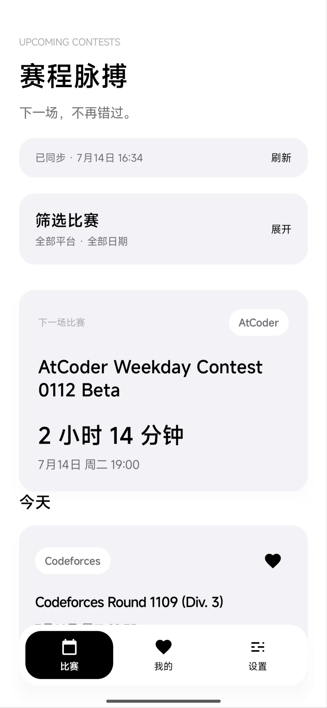
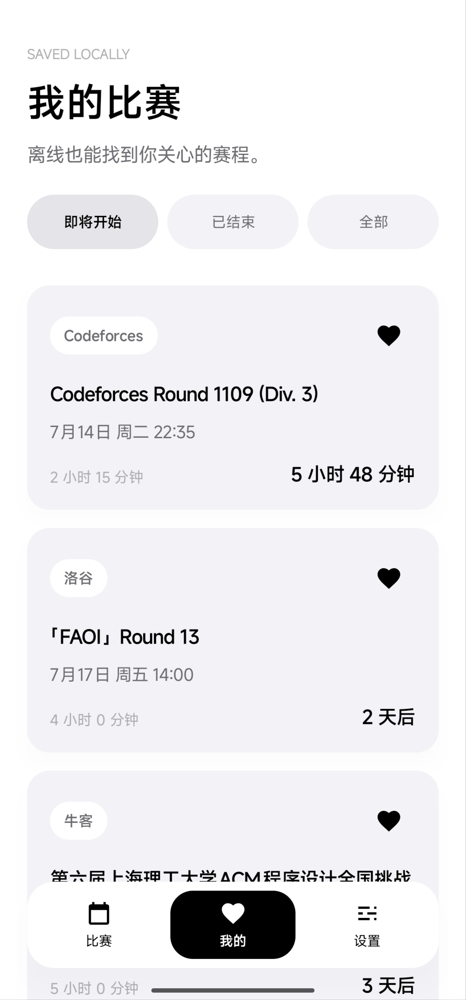
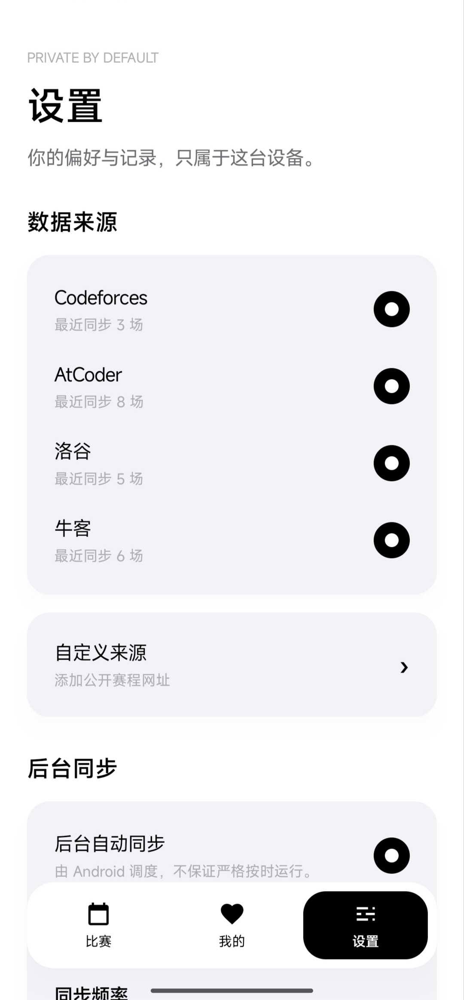

<div align="center">

# Contest Pulse

**面向算法竞赛用户的本地优先 Android 赛程聚合与提醒工具**

聚合 Codeforces、AtCoder、洛谷、牛客与自定义公开赛程，统一展示本地时间、倒计时、收藏和提醒。

<p>
  
  
  
  
  
</p>

**简体中文** · [English](README_EN.md)

[界面预览](#界面预览) · [功能亮点](#功能亮点) · [支持的数据源](#支持的数据源) · [快速开始](#快速开始) · [自定义来源](#添加自定义来源) · [架构](#架构) · [验证](#项目验证)

</div>

---

## 项目简介

Contest Pulse 是一款无业务后端、无账号系统的 Android App。它从公开 API 或公开网页同步近期算法比赛，将不同平台的时间和字段规范化后保存在本机，并提供收藏、倒计时、系统日历和本地提醒。

报名、登录与提交始终在竞赛平台官方页面完成。App 不保存平台账号、密码、Cookie 或令牌，也不会把收藏和提醒上传到服务器。

正式签名的 1.0 安装包可从 [GitHub Releases](https://github.com/DuckLing-IO/ContestPulse/releases/tag/v1.0) 下载。

## 界面预览

<table>
  <tr>
    <th width="33%">比赛</th>
    <th width="33%">我的</th>
    <th width="33%">设置</th>
  </tr>
  <tr>
    <td></td>
    <td></td>
    <td></td>
  </tr>
  <tr>
    <td align="center">聚合赛程、倒计时与折叠筛选</td>
    <td align="center">离线保存关注比赛并按状态浏览</td>
    <td align="center">管理内置/自定义来源与同步策略</td>
  </tr>
</table>

## 功能亮点

| 能力 | 说明 |
| --- | --- |
| 多平台聚合 | 内置 Codeforces、AtCoder、洛谷、牛客，并支持用户添加公开赛程来源 |
| 本地优先 | Room 离线缓存；刷新失败时继续展示已有数据，不清空比赛列表 |
| 逐来源隔离 | 单个平台失败不会取消其他平台；首页明确显示失败来源 |
| 赛程浏览 | 下一场比赛、进行中/今天/明天/本周/更晚分组与实时倒计时 |
| 折叠筛选 | 按平台、未来 7/30 天、Rated、收藏筛选；无筛选时可保持折叠 |
| 收藏与提醒 | 预设及自定义提前时间，支持精确/非精确 AlarmManager 降级 |
| 系统集成 | 官方页面 Custom Tab、系统日历插入、通知点击直达比赛详情 |
| 后台同步 | DataStore 设置与 WorkManager 周期任务，支持 Wi-Fi 与 6/12/24 小时间隔 |
| 黑白设计系统 | Jetpack Compose、深浅色、圆角悬浮导航、无 ripple 按压与 spring 动效 |

## 支持的数据源

| 来源 | 接入方式 | 时间处理 |
| --- | --- | --- |
| [Codeforces](https://codeforces.com/apiHelp/methods) | 官方 `contest.list` JSON API | epoch seconds → UTC `Instant` |
| [AtCoder](https://atcoder.jp/contests/) | 公开 Upcoming / Daily HTML | 页面偏移时间 → UTC `Instant` |
| [洛谷](https://www.luogu.com.cn/contest/list) | 公开比赛列表 HTML | `Asia/Shanghai` → UTC `Instant` |
| [牛客](https://ac.nowcoder.com/acm/contest/vip-index) | 牛客系列赛与高校校赛公开 HTML | epoch milliseconds → UTC `Instant` |
| 自定义来源 | JSON、iCalendar、JSON-LD、内嵌 JSON、语义 HTML 或 CSS 字段映射 | 用户确认时区后统一转为 UTC |

AtCoder、洛谷、牛客和自定义 HTML 都不是稳定 API。解析器采用 fail-closed 与最小 fixture 回归测试：结构异常时只标记对应来源失败，并保留旧缓存。

## 快速开始

### 环境要求

| 项目 | 版本 |
| --- | --- |
| Android | 8.0 / API 26 或更高 |
| Compile / Target SDK | API 34 |
| JDK | 17 |
| Gradle Wrapper | 8.9 |
| Android Gradle Plugin | 8.5.2 |
| Kotlin | 1.9.24 |

### 使用 Android Studio

1. 克隆并打开仓库根目录。
2. 在 Android Studio 中选择 JDK 17，等待 Gradle Sync 完成。
3. 创建 Android 8.0（API 26）或更高版本的模拟器，或连接真机。
4. 运行 `app` 配置。
5. 首次进入比赛页后等待同步，或点击/下拉刷新。

首次导入时，在仓库根目录创建不会提交到 Git 的 `local.properties`：

```properties
sdk.dir=<你的 Android SDK 绝对路径>
```

### 命令行构建

Windows PowerShell：

```powershell
./gradlew.bat assembleDebug
adb install -r app/build/outputs/apk/debug/app-debug.apk
```

macOS / Linux：

```bash
./gradlew assembleDebug
adb install -r app/build/outputs/apk/debug/app-debug.apk
```

Debug APK 位于 `app/build/outputs/apk/debug/app-debug.apk`。APK、签名文件和本机 SDK 配置均已被 `.gitignore` 排除。

正式 Release 构建会读取仓库根目录下不会提交的 `keystore.properties`。复制 [`keystore.properties.example`](keystore.properties.example)、填写独立签名密钥信息后执行：

```powershell
./gradlew.bat assembleRelease
```

如果只需要安装稳定版本，请直接使用 [Releases](https://github.com/DuckLing-IO/ContestPulse/releases) 中已经签名并校验的 APK，无需自行配置签名。

## 添加自定义来源

打开 **设置 → 数据来源 → 自定义来源**：

1. 输入来源名称、公开 HTTPS 比赛列表网址和默认时区。
2. 保持“自动识别”，点击“解析并预览”。
3. 核对比赛名称与本地时间，确认无误后保存并启用。
4. 自动识别失败时，展开 HTML 字段映射，填写比赛条目、标题和开始时间的 CSS 选择器；结束时间、链接与时间格式可选。

保存前必须成功预览。每个自定义来源独立启停、独立同步、独立报错；删除来源会同时清理该来源的本地比赛、收藏和提醒。

### 自定义来源安全边界

- 只接受 HTTPS 公网地址，不允许 URL 内携带账号信息。
- 不执行网页 JavaScript，不使用 Cookie、登录态或 Authorization。
- 拒绝 localhost、私网、链路本地、CGNAT 和 IPv6 ULA 地址。
- 每次重定向重新校验主机，并把连接固定到已验证 DNS 地址。
- 最多 3 次重定向、1 MB 解压后正文、200 场未来/进行中比赛。
- 不支持需要登录、验证码、无限滚动或反自动化挑战的页面。

如果添加的是已内置平台网址，预览会提示先关闭对应内置来源，避免同一比赛重复显示。

## 架构

```text
Compose UI / ViewModel
          ↓
Domain models · filters · repository contracts
          ↑
Offline-first repository
    ├── Room: contests · favorites · reminders · sync status
    ├── Retrofit / OkHttp / Jsoup / Kotlinx Serialization
    ├── DataStore: sync preferences · custom source definitions
    ├── AlarmManager / Notification / Calendar Intent
    └── WorkManager: periodic source sync
```

```text
app/src/main/java/io/duckling/contestpulse/
├── core/          # Design System、Room、日历与安全外链
├── data/          # 内置/自定义远端解析、DataStore 与离线仓库
├── domain/        # 领域模型、筛选/时间逻辑与仓库契约
├── feature/       # 比赛、详情、收藏、设置与自定义来源页面
├── navigation/    # 三入口导航、子页面与通知 deep link
├── reminder/      # 闹钟、通知、权限和系统变化后的重排
└── sync/          # WorkManager 调度与后台同步入口
```

更详细的实现决策与维护规则：

- [架构设计](docs/ARCHITECTURE.md)
- [数据源维护](docs/DATA_SOURCES.md)
- [开发路线](docs/ROADMAP.md)
- [发布检查表](docs/RELEASE_CHECKLIST.md)

## 项目验证

当前 1.0 已完成以下自动化检查：

```powershell
./gradlew.bat testDebugUnitTest
./gradlew.bat lintDebug
./gradlew.bat assembleDebug
./gradlew.bat assembleDebugAndroidTest
./gradlew.bat assembleRelease
```

- 51 个 JVM 单元测试通过。
- Android Lint：0 errors；现有 warnings 仅为依赖/工具版本建议。
- Debug APK 与 AndroidTest APK 构建通过。
- Release R8 压缩与资源收缩构建通过。
- 牛客两个公开分类的在线只读校验通过；离线测试覆盖双层 HTML 实体编码。

执行 Compose UI 与 Room 仪器测试需要连接模拟器或真机：

```powershell
./gradlew.bat connectedDebugAndroidTest
```

## 权限与隐私

| 权限 | 用途 |
| --- | --- |
| `INTERNET` | 读取用户启用的公开比赛数据 |
| `POST_NOTIFICATIONS` | Android 13+ 展示用户主动设置的比赛提醒 |
| `SCHEDULE_EXACT_ALARM` | 系统允许时提供更准时的提醒，不可用时自动降级 |
| `RECEIVE_BOOT_COMPLETED` | 重启后恢复仍然有效的本地提醒 |

App 禁止 Android 云备份，不记录 Cookie、认证 Header、账号或密码。收藏、设置、自定义来源和提醒只保存在当前设备。Contest Pulse 与上述竞赛平台不存在官方合作或隶属关系。

## 已知限制

- WorkManager 和非精确闹钟受 Android 及厂商节电策略影响，无法保证严格准点。
- 网页来源改版后可能暂时解析失败；旧缓存与其他来源不受影响。
- 当前构建目标为 API 34，正式商店发布前需按届时政策升级并完成真机回归。
- 仓库当前未附带运行截图；发布前应从真实设备采集浅色、深色与大字体截图。
- 当前仓库尚未声明开源许可证；公开可见不等于自动授予复制、修改或分发权利。
